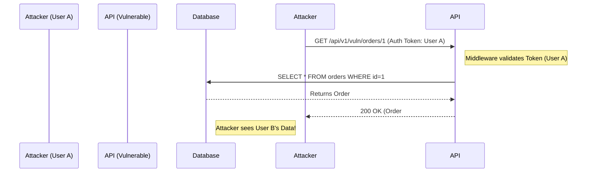
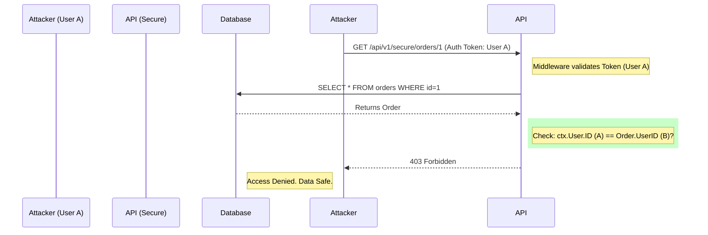

# Threat Model: Order Management System

## System Description

The Order Management System allows users to place and view their stock orders. The key assets are:

- **Order Data**: Order details (Stock Symbol, Amount, Type), which are financial and personal.
- **User Integrity**: Users should only view and manage their own orders.

## STRIDE Analysis

| Threat Category            | Description                                                 | Violation                                           | Mitigation Status             |
| :------------------------- | :---------------------------------------------------------- | :-------------------------------------------------- | :---------------------------- |
| **S**poofing               | Attacker impersonates another user.                         | **N/A** (Assuming JWT Auth is robust).              | ✅ Mitigated (JWT)            |
| **T**ampering              | User modifies order details (ID, Amount) to trade unfairly. | Potential violation if input validation is missing. | ⚠ Risk (Needs Validation)     |
| **R**epudiation            | User denies placing an order.                               | Audit logs missing.                                 | ⚠ Risk (Need Audit Logs)      |
| **I**nformation Disclosure | **Attacker views another user's order details.**            | **CRITICAL VIOLATION (IDOR).**                      | ❌ **VULNERABLE** (See below) |
| **D**enial of Service      | Attacker spam orders to exhaust DB.                         | Availability impact.                                | ⚠ Risk (Needs Rate Limiting)  |
| **E**levation of Privilege | Regular user acts as Admin.                                 | Access Control missing.                             | ⚠ Risk (Needs RBAC)           |

## Deep Dive: Information Disclosure (IDOR)

### Scenario A: Vulnerable Flow (Current Implementation in `v1_vulnerable`)

An attacker authenticated as User A requests Order #1 (belonging to User B). The system checks _Authentication_ but fails to check _Authorization_ (Ownership).

### Scenario B: Secure Flow (Mitigation in `v1_secure`)

The system performs an ownership check comparing `claims.userID` with `order.userID`.

## Recommendations

1.  **Enforce Ownership Checks**: Every data access layer must verify `resource.owner_id == current_user.id`.
2.  **Use UUIDs**: Replace sequential Integer IDs with UUIDs to make enumeration difficult (Defense in Depth).
3.  **Automated Testing**: Add negative test cases in CI/CD to verify 403 responses for cross-user access.
